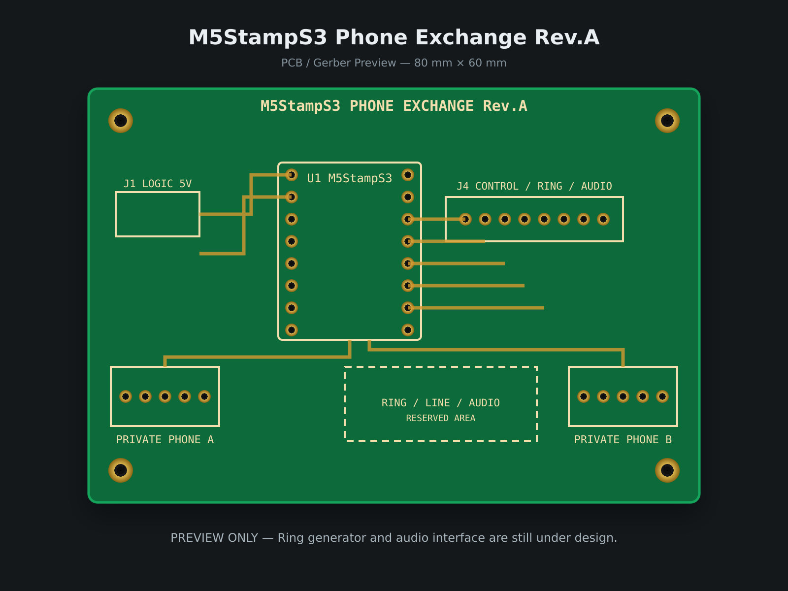

# M5StampS3 疑似電話交換機

M5Stack StampS3を使った、2回線対応の独立型アナログ疑似電話交換機です。

秋月電子の「PIC簡易疑似電話交換機キット」を現代化し、黒電話を含む2台の電話機で呼び出し・ベル鳴動・音声通話を行える装置を目指しています。公衆電話網（PSTN）には接続しません。



## 目標仕様

- RJ11電話端子×2
- M5Stack StampS3による状態制御
- 回線ごとのループ電流／オフフック検出
- 一方の電話機からもう一方を呼び出し
- 応答後の双方向音声通話
- 切断検出後に待機状態へ復帰
- Wi-Fi設定とOTAアップデート
- JLCPCBで製造可能な2層基板

## 電源系統

- `LOGIC_5V`：StampS3用の安定化済み5V電源
- `LINE_24V`：電話回線給電用の独立24V電源
- `RING_HV`：ベル鳴動用の高電圧回路（設計中）

12〜24VをStampS3の5V端子へ直接入力してはいけません。

## リポジトリ構成

- `firmware/`：PlatformIO／Arduinoファームウェア
- `hardware/`：回路図、PCB、Gerber、製造資料
- `docs/`：アーキテクチャと安全要件

## 現在の状態

- 電話交換機の状態機械を実装済み
- StampS3公式2.54mm DIPピン配置を確認済み
- Rev.A基板の部品配置を作成済み
- 電源系統をロジック5Vと電話回線24Vに分離
- 高電圧リンガ回路、音声回路、RJ11実部品フットプリントは設計中

掲載画像は現在のPCBデータから作ったRev.Aプレビューです。製造用Gerberの最終版ではありません。

## ビルド

```sh
cd firmware
pio run
```

## 安全上の注意

リンガ回路ではSELV（安全特別低電圧）の範囲を超える電圧が発生します。電流制限、沿面距離・空間距離、保護されたテストポイント、絶縁ケースを設けてください。通電中の高電圧部には触れないでください。

## 参考資料

- [M5Stack StampS3公式ドキュメント](https://docs.m5stack.com/en/core/StampS3)
- [秋月電子 PIC簡易疑似電話交換機キット資料](https://akizukidenshi.com/img/contents/kairo/%E3%83%87%E3%83%BC%E3%82%BF/%E3%81%9D%E3%81%AE%E4%BB%96/L013_%E7%96%91%E4%BC%BC%E9%9B%BB%E8%A9%B1%E4%BA%A4%E6%8F%9B%E6%A9%9F.pdf)
