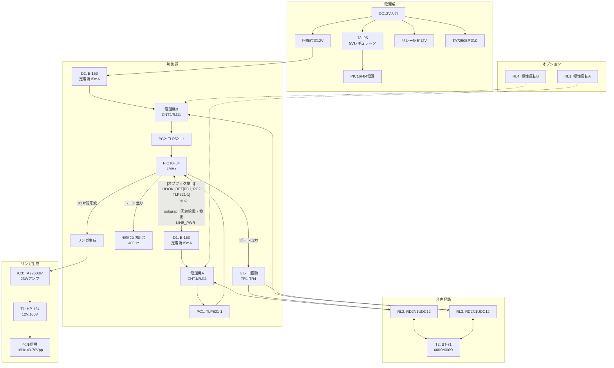
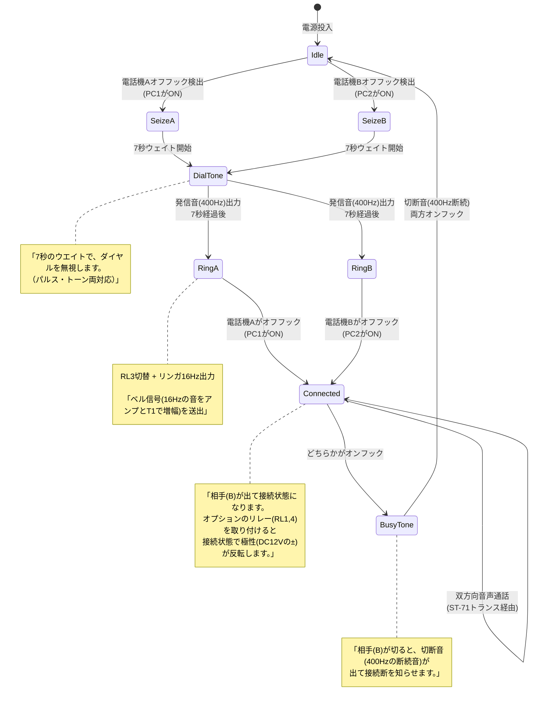

# 秋月電子 PIC簡易疑似電話交換機キット (L013) 回路分析

## 出典

**製品名**: PIC簡易疑似電話交換機キット  
**型番**: L013  
**販売元**: 秋月電子通商  
**設計**: TriState Y.Yoshikawa (Copyright 1998 Feb.)  
**PDF URL**: https://akizukidenshi.com/img/contents/kairo/%E3%83%87%E3%83%BC%E3%82%BF/%E3%81%9D%E3%81%AE%E4%BB%96/L013_%E7%96%91%E4%BC%BC%E9%9B%BB%E8%A9%B1%E4%BA%A4%E6%8F%9B%E6%A9%9F.pdf

### 概要 (PDFより引用)

> ★PIC16F84を使用したNTT交換機モドキのシュミレーター（疑似交換機）です。  
> ★1対1で電話公衆回線をシュミレーションする事が出来ます。  
> ○2台のパソコン間をモデムを通してローカル通信や通信テストに最適です。  
> ○2台の電話機を接続すれば、そのままインターホンとして、学校・会社では電話の応対練習に、電気店では動作可能状態でのデモ・ディスプレーが実現できます  
> ★パソコンのFAXソフトを使って、市販FAXを改造無しでそのままプリンターとして、又逆にFAXをスキャナー代わりに画像をパソコンに取り込む事ができます。  
> ★発信音（400Hz）、切断音（400Hz断続）、呼び出し音、ベル信号(16Hz)と、簡易装置ですが本格動作シュミレートします。  
> ★オプションのリレー2個追加で、接続時極性反転も可能です。  
> ★回線は、DC12V（48Vでは有りませんが200m以上配線引き回し可能）定電流でショート等の保護有り。  
> ★7秒のウエイトで、ダイヤルを無視します。（パルス・トーン両対応）  
> ★電源：DC12V 200mA

### 注意事項 (PDFより引用)

> ・絶対にNTT等の実際の電話回線には接続しないで下さい。  
> ・この装置はアナログ電話機器専用です、デジタルには対応しておりません。  
> ・ベル信号は、16Hz70Vの交流が流れます。感電に注意して下さい。

---

## ブロック図



---

## 電源仕様

### 入力電源

| 項目 | 仕様 | 備考 |
|------|------|------|
| 入力電圧 | DC12V | 48Vではない |
| 消費電流 | 200mA | 最大 |
| 保護 | 定電流回路 | ショート保護あり |

### 48V比較ノート (PDFより)

> 通常の電話回線は、定電流であり直流DC-48Vがかかっています。これは何Kmもの電話線の抵抗分により電圧降下が有るからです。この回路では短距離で入手しやすいDC12Vを使用しています。これでも、数100mは引き回す事が出来ます。

### 回線電流制限 (PDFより)

> 電源はトランスを通り音声結合し、定電流はCRD（定電流ダイオード）を使用して15〜20mAの定電流回路を成し、回線の短絡に対し保護をしています。

**設計ポイント**:
- 定電流ダイオード E-153 を使用 (定格 15mA)
- 実際のPSTN (48V) ではなく12Vで動作
- 短距離用途（〜数100m）を想定

---

## 部品リスト (BOM)

### 主要IC

| 記号 | 型番 | 数量 | 機能 | 備考 |
|------|------|------|------|------|
| IC1 | PIC16F84 | 1 | マイコン制御 | プログラム書き込み済み |
| IC2 | 78L05 | 1 | 5V電源用3端子レギュレータ | |
| IC3 | TA7250BP | 1 | 23Wオーディオアンプ | リンガ信号増幅用 |

### 半導体

| 記号 | 型番 | 数量 | 機能 |
|------|------|------|------|
| TR1〜TR4 | 2SC1815 | 4 | 汎用PNPトランジスタ (リレー駆動等) |
| PC1, PC2 | TLP521-1 | 2 | 光アイソレータ (オフフック検出) |
| D1, D2 | E-153 | 2 | 20mA定電流ダイオード |
| D3〜D6 | S5277B | 4 | サージ防止汎用ダイオード (フライバック) |
| XTAL | CST4.00MGW | 1 | 4MHzセラミック発振子 |
| D7 | TLR113A | 1 | 電源用赤色LEDランプ |

### トランス

| 記号 | 型番 | 数量 | 仕様 | 用途 |
|------|------|------|------|------|
| T1 | HP-124 | 1 | 100V:12V | リンガ昇圧 (逆接続で12V→約70V) |
| T2 | ST-71 | 1 | 600Ω:600Ω | 音声結合 (スピーチトランス) |

### リレー

| 記号 | 型番 | 数量 | 仕様 | 用途 |
|------|------|------|------|------|
| RL2, RL3 | RD2N1UDC12 | 2 | 2回路2接点 12V | 回線切替 |
| RL1, RL4 | RD2N1UDC12 | 0 (オプション) | 2回路2接点 12V | 極性反転オプション |

### 抵抗

| 記号 | 値 | 数量 | カラーコード | 用途 |
|------|------|------|--------------|------|
| R1 | 4.7kΩ | 1 | 黄紫赤金 | |
| R2, R3 | 10kΩ | 2 | 茶黒橙金 | フォトカプラプルアップ |
| R4〜R7 | 2.2kΩ | 4 | 赤赤赤金 | トランジスタベース抵抗 |
| R8, R10, R12 | 1kΩ | 3 | 茶黒赤金 | |
| R9, R11 | 20Ω | 2 | 赤黒黒金 | 給電抵抗 |

### コンデンサ

| 記号 | 値 | 数量 | 種類 | 用途 |
|------|------|------|------|------|
| C1, C3, C4, C18 | 0.1µF (104) | 4 | 積層セラミック | バイパス |
| C2, C5, C6, C7 | 10µF | 4 | 電解 | |
| C9, C10 | 100µF | 2 | 電解 | 電源フィルタ |
| C8, C11, C12 | 220µF | 3 | 電解 | 電源フィルタ |
| C13 | 0.033µF (333) | 1 | マイラー | 音声結合 |
| C14, C15 | 0.15µF (154) | 2 | マイラー | 音声結合 |

### コネクタ・その他

| 記号 | 型番 | 数量 | 用途 |
|------|------|------|------|
| CNT1, CNT2 | TM2REA-06 | 2 | 6ピンモジュラージャック (RJ11) |
| - | 18P | 1 | PIC16F84用ICソケット |
| - | TS-ETC1A | 1 | 両面スルホール・ガラス基板 |

---

## 回路動作原理

### 基本回路 (PDFより引用)

> A, B回線には、各々定電流の直流電源が接続されています。接続された機器は、その電源により動作します。どちらかの接続機器より送られた音声信号は、交流成分としてT, Cによりアイソレートされ相手の回線に伝えられます。

```text
基本回路:

     ┌──────┐          C           ┌──────┐
A+ ──┤定電流回路├────┤├────┤定電流回路├── B+
     └────┬─┘    AT    BT    └─┬────┘
          │                        │
回線A     │      ┌────┐          │     回線B
          │      │回線電源│          │
A- ───────┴──────┴────┴──────────┴─────── B-
```

### リンガ生成方式 (PDFより引用)

> ベル信号は、交流16Hz75Vが必要です。PICから16Hzの矩形信号を出力し、簡易正弦波にしてオーディオアンプに入力します。増幅された信号をトランスで更に昇圧して交流16Hz40〜70Vを作ります。

```text
本キットのベル信号発生原理:

┌─────┐     16Hz5V信号発生     ┌────────┐     ┌─────────┐     ベル信号
│ PIC  ├──────┬──────────────┤  23W      ├─────┤ 12V:100V ├───→ 交流16Hz
└─────┘      │               │オーディオ │     │ トランス │      40-70V
              │               │ アンプ   │     │ (HP-124) │
             ───              └────────┘     └─────────┘
             ───  コンデンサ
              │   DC カット
             ─┴─
```

### 通話フロー

PDFの記述と回路図から推定した動作フロー:



### 動作詳細 (PDFより引用)

> 発信（A回線を例）は受話器を持ち上げた際の電流によりPC1のフォトカプラが検知するとPICが検知すると発信音(400Hz)を発生し7秒のウエイト（ダイヤルを無視する）後、RL3（B回線リレー）を切り替えB回線にベル信号（16Hzの音をアンプとT1で増幅）を送出します。送出の合間にPC2がON（相手が出た）になったか検知します。相手(B)が出て接続状態になります。  
> オプションのリレー(RL1,4)を取り付けると接続状態で極性(DC12Vの±)が反転します。  
> こちら(A)又は相手(B)が切ると、切断音(400Hzの断続音)が出て接続断を知らせます。どちらも切れた時点で初期状態になります。A, B双方向に動作をします。

---

## M5StampS3への置換マッピング

### 置換対象 (デジタル制御部)

| 秋月キット部品 | M5StampS3版 | 備考 |
|---------------|-------------|------|
| PIC16F84 | ESP32-S3 | M5StampS3内蔵 |
| 78L05 (IC2) | 不要 | StampS3内蔵DC-DC |
| CST4.00MGW (水晶) | 不要 | ESP32-S3内蔵 |
| TLR113A (電源LED) | 不要 | StampS3内蔵RGB LED |

### 維持するアナログフロントエンド

| 秋月キット部品 | 維持/変更 | 理由 |
|---------------|----------|------|
| TA7250BP (IC3) | **維持** | リンガ信号増幅に必須 |
| HP-124 (T1) | **維持** | リンガ昇圧トランス |
| ST-71 (T2) | **維持** | 音声結合トランス |
| TLP521-1 (PC1, PC2) | **維持** | オフフック検出・絶縁 |
| E-153 (D1, D2) | **維持** | 定電流回線給電 |
| RD2N1UDC12 (RL2, RL3) | **維持** | 回線切替リレー |
| 2SC1815 (TR1-TR4) | **維持** | リレー駆動トランジスタ |
| S5277B (D3-D6) | **維持** | フライバックダイオード |

### GPIO割り当て (M5StampS3 PIN2.54版)

M5StampS3 PIN2.54版は10本のGPIOを提供:

| GPIO | 方向 | 機能 | 秋月キット相当 |
|------|------|------|---------------|
| GPIO1 | 入力 | オフフック検出A | PC1出力 |
| GPIO3 | 入力 | オフフック検出B | PC2出力 |
| GPIO5 | 出力 | 回線リレーA | RL2制御 (TR経由) |
| GPIO7 | 出力 | 回線リレーB | RL3制御 (TR経由) |
| GPIO9 | 出力 | リンガ有効化 | TA7250BP EN相当 |
| GPIO13 | 出力 | 16Hz矩形波 | PICリンガ出力 |
| GPIO43 | I/O | I2C SDA | 拡張用 |
| GPIO44 | I/O | I2C SCL | 拡張用 |

### 電源構成の変更

| 秋月キット | M5StampS3版 | 理由 |
|-----------|-------------|------|
| DC12V単一入力 | 5V + 12V分離入力 | StampS3は5V入力が必要 |
| 78L05で5V生成 | StampS3内蔵DC-DC | 外部レギュレータ不要 |

---

## 注意事項・免責

### OCR/PDF抽出の限界

1. **画像ベースPDF**: 本PDFはスキャン画像ベースであり、テキスト抽出が困難でした。回路図や部品配置図は画像として抽出しています。

2. **手書き/印刷の解読**: 回路図の一部は手書きまたは低解像度印刷のため、部品値や接続が不明瞭な箇所があります。

3. **推定箇所**: 以下は画像からの推定であり、検証が必要です:
   - 一部の抵抗値・コンデンサ値
   - 回路図の細かい接続
   - PICのポート割り当て

### 未検証事項

- **ネット接続**: 回路図から読み取ったネットは目視確認のみで、実機検証していません。
- **部品互換性**: 記載された部品の一部は入手困難な可能性があります。代替品の検証が必要です。
- **動作確認**: M5StampS3版の回路は未検証です。

### ドロップイン複製禁止

> ⚠️ **この分析を秋月キットの完全なコピーとして使用しないでください。**

- 元の設計は1998年のものであり、現在の部品入手性や設計基準と異なる可能性があります。
- 高電圧（リンガ40-70V）を扱う回路であり、安全設計の検証が必要です。
- ERC/DRC未実施の回路を製造してはいけません。

### 安全上の警告

> ・ベル信号は、16Hz70Vの交流が流れます。感電に注意して下さい。

リンガ回路はSELV（安全特別低電圧: AC 25V / DC 60V）の範囲を超えます。以下の対策が必要です:

- 沿面距離・空間距離の確保
- 電流制限抵抗の設置
- 絶縁ケースの使用
- 通電中の高電圧部への接触禁止

---

## 参考画像

抽出した画像は `docs/akizuki_images/` に保存されています:

| ファイル | 内容 |
|----------|------|
| page-001.png | 表紙・概要・注意事項 |
| page-002.png | パーツリスト (BOM) |
| page-003.png | 回路図・使用部品の極性/形状 |
| page-004.png | 基板パターン・組立・調整手順 |
| page-005.png | 動作原理説明・ベル信号発生原理 |
| page-006.png | 接続使用例 (電話-電話, PC-PC, FAX-PC) |
| page-007.png | 回線電圧変更 (DC24V/48V改造) |
| page-008.png | 電源/アンプ発熱注意・CRDデータシート |
| page-009.png | PIC16F84データシート |
| page-010.png | TA7250BP/HPシリーズトランスデータシート |

---

## 変更履歴

| 日付 | 内容 |
|------|------|
| 2026-09-21 | 初版作成。秋月電子L013 PDFを分析し文書化。 |
